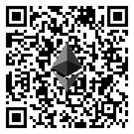

# BTCRecover
[/badge.svg)](https://github.com/3rdIteration/btcrecover/actions?query=workflow%3A%22Last+Push+-+All+Tests+%28Base+Modules%29%22) [/badge.svg)](https://github.com/3rdIteration/btcrecover/actions?query=workflow%3A%22Weekly+-+All+Tests+%28Base+Modules%29%22) [//badge.svg)](https://github.com/3rdIteration/btcrecover/actions?query=workflow%3A%22Weekly+-+All+Tests+%28%2BOptional+Modules%29%22)   

*BTCRecover* is an open source wallet password and seed recovery tool.

For seed based recovery, this is primarily useful in situations where you have lost/forgotten parts of your mnemonic, or have made an error transcribing it. (So you are either seeing an empty wallet or getting an error that your seed is invalid)

For wallet password or passphrase recovery, it is primarily useful if you have a reasonable idea about what your password might be.

# Documentation:
### Instructions for installation, usage & examples:  [https://btcrecover.readthedocs.io/](https://btcrecover.readthedocs.io/)

[(You can also view the documentation in your browser locally by following the instructions here. )](docs/local_mkdocs.md)

If you need help, [your best bet is to look at my BTCRecover playlist on YouTube](https://www.youtube.com/playlist?list=PL7rfJxwogDzmd1IanPrmlTg3ewAIq-BZJ) and ask a question in the comments section for any of video closest to your situation.

## Features ##
* BIP39 Seed/Passphrase Recovery when for: (Recovery without a known address requires an [Address Database](docs/Creating_and_Using_AddressDB.md))
    * Avalanche
    * Bitcoin
    * Bitcoin Cash
    * Cardano (Shelley Era Addresses)
    * Cosmos (Atom)
    * Dash
    * DigiByte
    * Dogecoin
    * Ethereum
    * Groestlcoin
    * Helium
    * Litecoin
    * Monacoin
    * Polkadot (sr25519, like those produced by polkadot.js)
    * Ripple
    * Secret Network
    * Solana
    * Stacks
    * Stellar
    * Tezos
    * Tron
    * Vertcoin
    * Zilliqa
    * And many other 'Bitcoin Like' cryptos
 * SLIP39 Passphrase Recovery for most coins supported by the Trezor T
    * Bitcoin
    * Bitcoin Cash
    * Dash
    * Digibyte
    * Dogecoin
    * Ethereum
    * Litecoin
    * Ripple
    * Vertcoin
 * [Descrambling 12 word seeds](docs/BIP39_descrambling_seedlists.md) (Using Tokenlist feature for BIP39 seeds via seedrecover.py)
 * Wallet File password recovery for a range of wallets

* Seed Phrase (Mnemonic) Recovery for the following wallets
     * [Electrum](https://electrum.org/) (1.x, 2.x, 3.x and 4.x) (For Legacy and Segwit Wallets. Set --bip32-path "m/0'/0" for a Segwit wallet, leave bip32-path blank for Legacy... No support for 2fa wallets...)
     * [Electron-Cash](https://www.electroncash.org/) (2.x, 3.x and 4.x)
     * BIP-32/39 compliant wallets ([bitcoinj](https://bitcoinj.github.io/)), including:
         * [MultiBit HD](https://multibit.org/)
         * [Bitcoin Wallet for Android/BlackBerry](https://play.google.com/store/apps/details?id=de.schildbach.wallet) (with seeds previously extracted by [decrypt\_bitcoinj\_seeds](https://github.com/gurnec/decrypt_bitcoinj_seed))
         * [Hive for Android](https://play.google.com/store/apps/details?id=com.hivewallet.hive.cordova), [for iOS](https://github.com/hivewallet/hive-ios), and [Hive Web](https://hivewallet.com/)
         * [Breadwallet](https://brd.com/)
     * BIP-32/39/44 Bitcoin & Ethereum compliant wallets, including:
         * [Mycelium for Android](https://wallet.mycelium.com/)
         * [TREZOR](https://www.bitcointrezor.com/)
         * [Ledger](https://www.ledgerwallet.com/)
         * [Keepkey](https://shapeshift.io/keepkey/)
         * [ColdCard](https://coldcardwallet.com/)
         * [Jaxx](https://jaxx.io/)
         * [Coinomi](https://www.coinomi.com/)
         * [Exodus](https://www.exodus.io/)
         * [MyEtherWallet](https://www.myetherwallet.com/)
         * [Bither](https://bither.net/)
         * [Blockchain.com](https://blockchain.com/wallet)
 * Bitcoin wallet password recovery support for:
     * [Bitcoin Core](https://bitcoincore.org/)
     * [MultiBit HD](https://multibit.org/) and [MultiBit Classic](https://multibit.org/help/v0.5/help_contents.html)
     * [Electrum](https://electrum.org/) (1.x, 2.x, 3.x and 4.x) (For Legacy and Segwit Wallets. Set --bip32-path "m/0'/0" for a Segwit wallet, leave bip32-path blank for Legacy... No support for 2fa wallets...)
     * Most wallets based on [bitcoinj](https://bitcoinj.github.io/), including [Hive for OS X](https://github.com/hivewallet/hive-mac/wiki/FAQ)
     * BIP-39 passphrases (Also supports all cryptos supported for seed recovery, as well as recovering "Extra Words" for Electrum seeds)
     * [mSIGNA (CoinVault)](https://ciphrex.com/products/)
     * [Blockchain.com](https://blockchain.com/wallet)
     * [block.io](https://block.io/) (Recovery of wallet "Secret PIN")
     * [pywallet --dumpwallet](https://github.com/jackjack-jj/pywallet) of Bitcoin Unlimited/Classic/XT/Core wallets
     * [Bitcoin Wallet for Android/BlackBerry](https://play.google.com/store/apps/details?id=de.schildbach.wallet) spending PINs and encrypted backups
     * [KnC Wallet for Android](https://github.com/kncgroup/bitcoin-wallet) encrypted backups
     * [Bither](https://bither.net/)
     * [Encrypted (BIP-38) Paper Wallet Support (Eg: From Bitaddress.org)](https://bitaddress.org) Also works with altcoin forks like liteaddress.org, paper.dash.org, etc...
     * Brainwallets
        * Sha256(Passphrase) brainwallets (eg: Bitaddress.org, liteaddress.org, paper.dash.org)
        * sCrypt Secured Brainwallets (Eg: Warpwallet, Memwallet)
 * Altcoin password recovery support for most wallets derived from one of those above, including:
     * [Coinomi](https://www.coinomi.com/en/) (Only supports password protected wallets)
     * [Metamask](https://metamask.io/) (And Metamask clones like Binance Chain Wallet, Ronin Wallet, etc.)
     * [Litecoin Core](https://litecoin.org/)
     * [Electrum-LTC](https://electrum-ltc.org/) (For Legacy and Segwit Wallets. Set --bip32-path "m/0'/0" for a Segwit wallet, leave bip32-path blank for Legacy... No support for 2fa wallets...)
     * [Electron-Cash](https://www.electroncash.org/) (2.x, 3.x and 4.x)
     * [Litecoin Wallet for Android](https://litecoin.org/) encrypted backups
     * [Dogecoin Core](http://dogecoin.com/)
     * [MultiDoge](http://multidoge.org/)
     * [Dogechain.info](https://dogechain.info/)
     * [Dogecoin Wallet for Android](http://dogecoin.com/) encrypted backups
     * [Yoroi Wallet for Cardano](https://yoroi-wallet.com/#/) Master_Passwords extracted from the wallet data (In browser or on rooted/jailbroken phones)
     * [Ethereum UTC Keystore Files](https://myetherwallet.com) Ethereum Keystore files, typically used by wallets like MyEtherWallet, MyCrypto, etc. (Also often used by Eth clones like Theta, etc)
     * [Damaged Raw Eth Private Keys]() Individual Private keys that are missing characters.
 * [Free and Open Source](http://en.wikipedia.org/wiki/Free_and_open-source_software) - anyone can download, inspect, use, and redistribute this software
 * Supported on Windows, Linux, and OS X
 * Support for Unicode passwords and seeds
 * Multithreaded searches, with user-selectable thread count
 * Ability to spread search workload over multiple devices
 * [GPU acceleration](docs/GPU_Acceleration.md) for Bitcoin Core Passwords, Blockchain.com (Main and Second Password), Electrum Passwords + BIP39 and Electrum Seeds
 * Wildcard expansion for passwords
 * Typo simulation for passwords and seeds
 * Progress bar and ETA display (at the command line)
 * Optional autosave - interrupt and continue password recoveries without losing progress
 * Automated seed recovery with a simple graphical user interface
 * Ability to search multiple derivation paths simultaneously for a given seed via --pathlist command (example pathlist files in the )
 * “Offline” mode for nearly all supported wallets - use one of the [extract scripts (click for more information)](docs/Extract_Scripts.md) to extract just enough information to attempt password recovery, without giving *btcrecover* or whoever runs it access to *any* of the addresses or private keys in your Bitcoin wallet.

## Setup and Usage Tutorials ##
BTCRecover is a Python (3.7, 3.8, 3.9, 3.10) script so will run on Windows, Linux and Mac environments. [See the installation guide for more info](docs/INSTALL.md)

[I have created a growing playlist](https://www.youtube.com/playlist?list=PL7rfJxwogDzmd1IanPrmlTg3ewAIq-BZJ) that covers a number of usage examples for using this tool to recover seed phrases, BIP39 passphrases, etc.

This repository also included some example commands and file templates in the ./docs/ folder of the repository.

My suggestion is that you find a scenario that is most-like your situation and try to replicate my examples to ensure that you have the tool set up and running correctly. If you have a specific situation that isn't covered in these tutorials, let me know and I can look into creating a video for that.

If you don't know an address in the wallet that you are searching for, you can create and use an [Address Database (click here for guide)](docs/Creating_and_Using_AddressDB.md) _There is no real performance penalty for doing this, it just takes a bit more work to set up_.

## Quick Start ##

To try recovering your password or a BIP39 passphrase, please start with the **[Password Recovery Quick Start](docs/TUTORIAL.md#btcrecover-tutorial)**.

If you mostly know your recovery seed/mnemonic (12-24 recovery words), but think there may be a mistake in it, please see the **[Seed Recovery Quick Start](docs/Seedrecover_Quick_Start_Guide.md)**.

## If this tool or other content on my YouTube channel was helpful, feel free to send a tip to: ##

BTC: 37N7B7sdHahCXTcMJgEnHz7YmiR4bEqCrS

BCH: qpvjee5vwwsv78xc28kwgd3m9mnn5adargxd94kmrt

LTC: M966MQte7agAzdCZe5ssHo7g9VriwXgyqM

ETH: 0x72343f2806428dbbc2C11a83A1844912184b4243

## Thanks to Gurnec ##
This tool builds on the original work of Gurnec who created it and maintained it until late 2017. If you find *btcrecover* helpful, please consider a small donation to them too. (I will also be passing on a portion of any tips I recieve at the addys above to them too)

BTC: 3Au8ZodNHPei7MQiSVAWb7NB2yqsb48GW4

**Thank You!**
